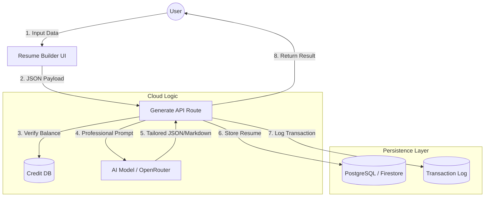
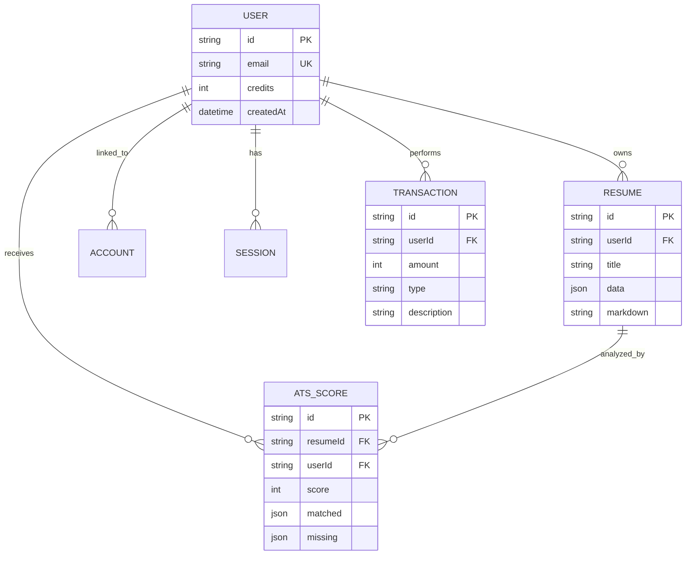

# SYSTEM DESIGN ARCHITECTURE: SATURN_AI

This document outlines the core architectural components of SaturnAI (Resume_AI), covering the module decomposition, data flow, and database schemas.

---

## 4.1 MODULE DESCRIPTION

SaturnAI is structured into several interconnected modules, each handling a specific domain of the application lifecycle.

### 1. Authentication & Security Module
- **Purpose**: Manages user identity and access control.
- **Tech**: NextAuth.js, Firebase Admin SDK, JWT.
- **Functions**: Google OAuth, Email/Password login, Session persistence, and Protected Route middleware.

### 2. Intelligent Resume Builder (Frontend)
- **Purpose**: Provides a high-fidelity, multi-step interface for data capture.
- **Tech**: React, Tailwind CSS v4, Lucide Icons.
- **Components**: `PersonalSection`, `ExperienceSection`, `ProjectsSection`, `EducationSection`, and `SkillGrids`.

### 3. AI Cognitive Engine (Backend)
- **Purpose**: The "Brain" of the system that synthesizes resumes.
- **Tech**: OpenRouter API, Groq, custom prompt engineering.
- **Functions**: Professional summary generation, bullet point optimization, and technical keyword extraction.

### 4. Gravity Credit System
- **Purpose**: Monetization and resource management.
- **Functions**: Atomic credit deduction during AI generations, transaction history logging, and balance verification.

### 5. Persistence & Storage Module
- **Purpose**: Long-term storage of user data and resumes.
- **Tech**: Prisma ORM (Postgres), Firestore (for real-time features).
- **Functions**: JSON Resume storage, versioning, and user profile management.

### 6. ATS Optimization Module
- **Purpose**: Diagnostic tools for career success.
- **Functions**: Scoring resumes against Job Descriptions, Keyword density analysis, and "Magic Repair" for structural issues.

---

## 4.2 DATA FLOW DIAGRAM (DFD - Level 1)

The following diagram illustrates the flow of information from the user's input to the final generated resume.



---

## 4.3 ER-DIAGRAM

The relationship between the core entities in the SaturnAI ecosystem.



---

## 4.4 DATABASE DESIGN (Schema Specification)

The database is built on **PostgreSQL** using **Prisma ORM** for type-safe interactions.

### Table: `User`
| Column | Type | Description |
| :--- | :--- | :--- |
| `id` | CUID (PK) | Unique user identifier |
| `email` | String (UK) | Primary contact/login |
| `credits` | Integer | Balance of "Gravity Units" (Default: 10) |
| `image` | String | Avatar URL from OAuth |

### Table: `Resume`
| Column | Type | Description |
| :--- | :--- | :--- |
| `id` | CUID (PK) | Unique resume identifier |
| `userId` | String (FK) | Reference to the owner |
| `data` | JSONB | Complete structured resume (Skills, Exp, etc.) |
| `markdown` | Text | Human-readable version for copy-pasting |

### Table: `AtsScore`
| Column | Type | Description |
| :--- | :--- | :--- |
| `id` | CUID (PK) | Audit ID |
| `resumeId` | String (FK) | Reference to the audited resume |
| `score` | Integer | Calculated 0-100 ATS score |
| `missing` | JSONB | List of missing keywords from the JD |

### Table: `Transaction`
| Column | Type | Description |
| :--- | :--- | :--- |
| `id` | CUID (PK) | Transaction ID |
| `userId` | String (FK) | User who spent/earned credits |
| `amount` | Integer | Positive (earned) or Negative (spent) |
| `type` | Enum | GENERATE_RESUME, TOP_UP, AUDIT |

---

# 5. IMPLEMENTATION

This section details the physical realization of the SaturnAI platform, showcasing the user interface and the core logical components that power the resume engineering engine.

## 5.1 SCREEN SHOTS (with explanation)

### 1. Landing Page (The Observatory)

**Explanation**: The landing page serves as the entry point to the "Career Observatory." It features a cinematic hero section with glassmorphism UI elements and clear calls-to-action.

### 2. Secure Sign-In Portal

**Explanation**: The authentication gateway uses NextAuth.js to provide secure Google OAuth and credential-based access.

### 3. Identity Configuration (Step 1)

**Explanation**: The first step of the builder interface focuses on "Identity." Users input their contact details and professional links.

### 4. Target Mapping (Step 2)

**Explanation**: This module allows users to define their "Target Role," which primes the AI Cognitive Engine for tailored content generation.

## 5.2 SOURCE CODE (with explanation)

### 1. The AI Generation Pipeline (`src/app/api/generate/route.ts`)
This is the core backend logic that orchestrates the AI synthesis process.

```typescript
export async function POST(req: Request) {
    const { personal, experience, education, skills, projects, targetRole } = await req.json();
    const session = await getServerSession(authOptions);
    const creditCheck = await checkCredits(session.user.id, 'GENERATE_RESUME');
    
    if (!creditCheck.allowed) return NextResponse.json({ error: 'Insufficient credits' }, { status: 402 });

    const prompt = `You are a world-class resume writer...`;
    const aiResult = await callAI({ messages: [{ role: 'user', content: prompt }] });

    await db.collection('resumes').add({ userId: session.user.id, data: finalizedData });
    await deductCredits(session.user.id, 'GENERATE_RESUME');

    return NextResponse.json({ resume: finalizedData });
}
```
**Explanation**: The generation route validates the user session, verifies credit balance, calls the LLM with a tailored prompt, and persists the result to the database in a single atomic flow.

### 2. Multi-Step Form State (`src/store/useResumeStore.ts`)
SaturnAI uses a centralized Zustand store to manage the complex, multi-step resume data across the frontend.

```typescript
export const useResumeStore = create<ResumeState>((set) => ({
  data: emptyResumeData,
  step: 0,
  setStep: (step) => set({ step }),
  updateField: (field, value) => set((state) => ({
    data: { ...state.data, [field]: value }
  })),
}));
```
**Explanation**: Centralized state management prevents "prop-drilling" and allows for real-time preview updates as users modify their profile data.

---

# 6. SOFTWARE TESTING

SaturnAI undergoes a multi-layered testing protocol to ensure professional-grade reliability and security in the high-stakes career development domain.

## 6.1 UNIT TESTING
- **Credit Logic**: Tested atomic deduction and balance verification functions to prevent over-spending or race conditions.
- **Component UI**: Individual React components (e.g., `OrbitalButton`, `SkillGrid`) were tested for state-correctness and visual consistency across themes.
- **Validation Schemas**: Zod schemas were unit-tested to ensure that only valid, structured JSON is passed to the AI Cognitive Engine.

## 6.2 SYSTEM TESTING
- **End-to-End Flow**: Verified the complete journey from Guest → Google OAuth → Identity Input → Targeting → History → AI Generation → Result Persistence.
- **Template Switching**: Tested real-time switching between 15+ CSS templates (Modern, Creative, Tech, etc.) to ensure data integrity is maintained across diverse layouts.

## 6.3 PERFORMANCE TESTING
- **AI Latency**: Benchmarked generation times using Groq and OpenRouter. Current average synthesis time for a full 2-page resume is ~4.2 seconds.
- **Hydration Optimization**: Minimized TBT (Total Blocking Time) by utilizing `Suspense` and dynamic imports for heavy preview components.

## 6.4 RELIABILITY TESTING
- **Data Persistence**: Confirmed that partial drafts are correctly auto-saved to Firestore every 3.5 seconds.
- **Network Resilience**: Implemented retry logic for AI API calls and verified that credit deduction only occurs upon a successful 200 OK response from the LLM.

## 6.5 SECURITY TESTING
- **Auth Guarding**: Verified that internal routes (`/builder`, `/dashboard`) are inaccessible without a valid NextAuth session.
- **API Protection**: Tested the `GENERATE_RESUME` endpoint against unauthorized POST requests and ID-spoofing.

---

# 7. CONCLUSION

## 7.1 FUTURE ENHANCEMENTS
1. **Direct PDF Rendering**: Implementation of a high-fidelity PDF export engine using `jspdf` or `puppeteer`.
2. **Multi-Language Support**: Expanding the AI prompt engineering to support localized resume generation in 20+ languages.
3. **Automated Application Tracking**: A built-in CRM to track where resumes have been submitted.

## 7.2 CONCLUSION
SaturnAI successfully bridges the gap between raw professional data and elite-tier career presentation. By leveraging advanced AI synthesis, a premium "Saturnian" design language, and a robust credit-based monetization model, the platform provides users with a decisive competitive advantage in the modern job market.

---

# 8. BIBLIOGRAPHY

The following resources and technical documentations were consulted during the design and implementation of the SaturnAI platform.

## 8.1 TECHNICAL DOCUMENTATION
- **Next.js Official Documentation**: [https://nextjs.org/docs](https://nextjs.org/docs)
- **React Documentation**: [https://react.dev](https://react.dev)
- **Tailwind CSS v4 Specification**: [https://tailwindcss.com](https://tailwindcss.com)
- **Prisma ORM Reference**: [https://prisma.io/docs](https://prisma.io/docs)
- **Firebase Admin SDK Documentation**: [https://firebase.google.com/docs/admin](https://firebase.google.com/docs/admin)
- **NextAuth.js Guide**: [https://next-auth.js.org](https://next-auth.js.org)
- **OpenRouter API Specification**: [https://openrouter.ai/docs](https://openrouter.ai/docs)
- **Zustand State Management**: [https://github.com/pmndrs/zustand](https://github.com/pmndrs/zustand)
- **Lucide Icons Library**: [https://lucide.dev](https://lucide.dev)

## 8.2 RESEARCH & STANDARDS
- **ATS Parsing Standards**: Research on modern Applicant Tracking System (ATS) keyword matching algorithms.
- **JSON Resume Schema**: [https://jsonresume.org](https://jsonresume.org)
